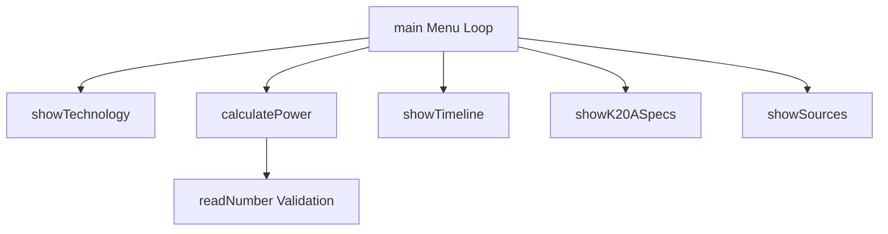

<div align="center">

# 🏎️ HONDA K20A i-VTEC CONSOLE SIMULATOR
### *High-Performance C++ Engine Dynamics & Shaft Power Engine*


```text
  ___ ___ ___ ___ ___   _   _ _____ ___ ___ 
 / __| _ \ __| __|   \ | | | |_   _| __/ C  |
 \__ \  _/ _|| _|| |) | \ \/ / | | | _| \__ |
 |___/_| |___|___|___/   \__/  |_| |___|___/ 
```

**Faculty of Computing and Informatics (FCI)**  
**Multimedia University**

</div>

---

## 🎓 Academic Project Information

| Parameter | Details |
| :--- | :--- |
| **Institution** | Multimedia University (MMU) |
| **Faculty** | Faculty of Computing and Informatics (FCI) |
| **Course Code** | LDCW6123 |
| **Project Name** | Honda K20A i-VTEC Educational Application |
| **Group** | G6 |

---

## 🏎️ Executive Summary

The **Honda K20A Educational Console** is a high-precision C++ application modeling the atmospheric physics, valve-timing transitions, and mechanical torque curves of Honda’s legendary **FD2 Civic Type R (K20A)** engine. 

Built with strict input validation and zero external library bloat, it calculates real-time mechanical shaft power while detailing the historical evolution of VTEC technology.

---

## ⚡ Technical Dashboard & K20A Engine Specs

| Metric / Parameter | Value | Gauge / Status |
| :--- | :--- | :--- |
| **Engine Configuration** | 2.0L DOHC i-VTEC (NA) | `[====================] 100% NA` |
| **Peak Shaft Power** | 165 kW (225 PS) @ 8,000 RPM | `[██████████████████░░] 90%` |
| **Peak Torque Output** | 215 Nm @ 6,100 RPM | `[████████████████████] 100%` |
| **VTEC Crossover Point** | ~5,800 RPM | `⚡ HIGH-CAM LIFT ENGAGED` |
| **Engine Redline** | 8,400 RPM | `[████████████████████] MAX LIMIT` |

---

## 📈 VTEC Lift & Torque Dynamics

<p align="center">
  
</p>

---

## 🛠️ System Architecture



---

## 🧮 Mathematical Engine

Mechanical shaft power $P$ in Kilowatts ($\text{kW}$) is calculated dynamically using rotational physics:

$$P = \frac{\tau \times \omega}{1000} = \frac{\tau \times N \times 2\pi}{60000}$$

Where:
* $\tau$ = Measured Shaft Torque ($\text{Nm}$)
* $N$ = Engine Speed ($\text{RPM}$)
* $\omega$ = Angular Velocity ($\text{rad/s}$)

---

## 🚀 Quick Start & Build Pipeline

### Prerequisites
Requires a C++17 compliant compiler (`g++`, `clang`, or MSVC).

### 1. Compile
```powershell
g++ -std=c++17 Vtec.cpp -o HondaVTEC.exe
```

### 2. Execute
```powershell
.\HondaVTEC.exe
```

### 3. Example Terminal Interactive Session
```text
=== HONDA VTEC EDUCATIONAL CONSOLE ===
1. Learn about VTEC / i-VTEC
2. View development timeline
3. View FD2 K20A specifications
4. Calculate engine power
5. View research sources
0. Exit
Choose an option (0-5): 4

--- POWER CALCULATOR ---
Enter torque in Nm (0-1000): 215
Enter engine speed in RPM (0-10000): 6100

Calculated power: 137.34 kW
```

---

## 👥 Engineering Team & Collaboration

<div align="center">

| Developer | Role | GitHub |
| :--- | :--- | :--- |
| **Zakariye** | System Logic & Power Calculator | [@Xach0-eng](https://github.com/Xach0-eng) |
| **Aidan** | Core Menu & VTEC Documentation | [@Aidzen](https://github.com/Aidzen) |
| **Afif** | Research Documentation & Program Testing | [nurafifnazreen](https://github.com/nurafifnazreen) |
<br/>

<sub>Built for Multimedia University (MMU) • Faculty of Computing and Informatics (FCI) • 2026</sub>

</div>
